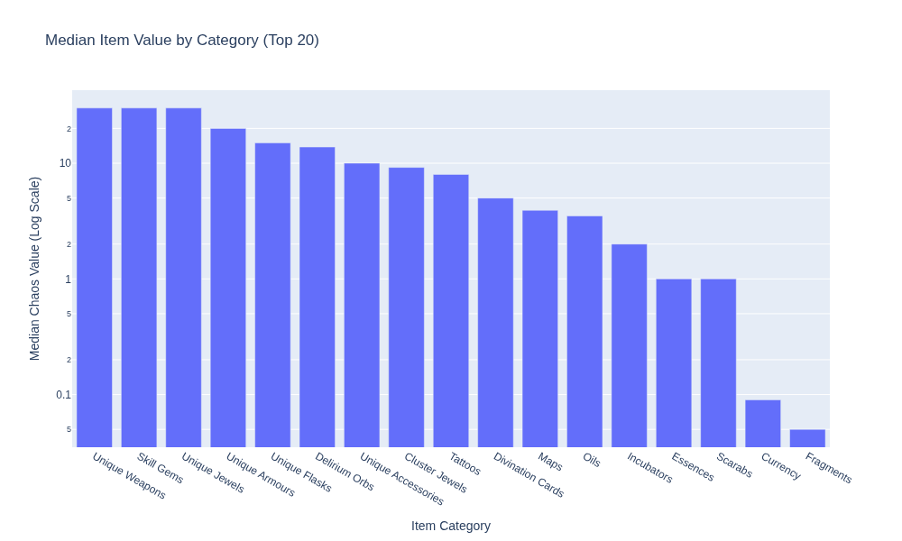
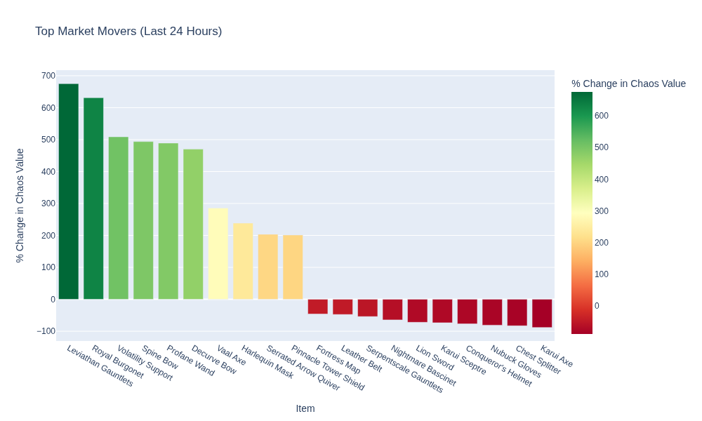

# PoE Tracker

This repository tracks data the **Mercenaries** league.

## Maintenance Status

<!-- START_MAINTENANCE -->
| Metric | Value |
|:---|:---|
| Last Successful Run (UTC) | `2025-10-01 10:13:51.823901` |
| Total Price Entries in DB | `1,420,770` |

<!-- END_MAINTENANCE -->

## Category Analysis

<!-- START_CATEGORY_ANALYSIS -->
### Most Valuable Item by Category
| Category | Top Item | Chaos Value |
| :--- | :--- | :--- |
| Skill Gems | Awakened Enlighten Support | 868382.0 |
| Base Types | Goliath Greaves | 347397.8 |
| Unique Accessories | Original Sin | 250154.6 |
| Unique Jewels | Voices | 243205.9 |
| Unique Relics | The Original Scripture | 135647.7 |
| Unique Weapons | The Surging Thoughts | 63165.9 |
| Runegrafts | Runegraft of the Angler | 60517.2 |
| Unique Armours | The Tempest's Liberation | 52307.1 |
| Divination Cards | House of Mirrors | 24677.3 |
| Unique Flasks | Wine of the Prophet | 23420.1 |
| Omens | Omen of Fortune | 9522.8 |
| Vials | Vial of the Ghost | 7563.0 |
| Incubators | Gemcutter's Incubator | 1512.6 |
| Tattoos | Journey Tattoo of the Body | 1185.6 |
| Cluster Jewels | 6% increased Mana Reservation Efficiency of Skills | 756.3 |

<!-- END_CATEGORY_ANALYSIS -->

## Market Movers & Overall Value

<!-- START_ANALYSIS -->
### Top 10 Most Valuable Items (Overall)
| Item | Chaos Value |
| :--- | :--- |
| Awakened Enlighten Support | 868382.0 |
| Awakened Empower Support | 521029.2 |
| Goliath Greaves | 347397.8 |
| Awakened Enhance Support | 347352.8 |
| Original Sin | 250154.6 |
| Voices | 243205.9 |
| Awakened Enlighten Support | 240179.8 |
| Divine Crown | 213787.0 |
| Anarchic Spiritblade | 173676.4 |
| Solaris Circlet | 173676.4 |

### Top 10 Gainers (24h)
| Item | Chaos Value | % Change |
| :--- | :--- | :--- |
| Ice Spear of Splitting | 280.39 | 1478.8% |
| Labrys | 20.8 | 462.2% |
| Commander's Brigandine | 50.0 | 257.1% |
| Imperial Staff | 52.0 | 246.7% |
| Maelström Staff | 45.0 | 240.9% |
| Ornate Spiked Shield | 150.82 | 236.5% |
| Mahogany Tower Shield | 89.2 | 224.4% |
| Grove Bow | 1260.2 | 221.4% |
| Dragonbone Rapier | 100.0 | 218.5% |
| Brand Recall | 1134.18 | 210.1% |

### Top 10 Losers (24h)
| Item | Chaos Value | % Change |
| :--- | :--- | :--- |
| Sorcerer Boots | 36.0 | -97.2% |
| Stealth Gloves | 15.0 | -75.0% |
| Searing Bond | 28.0 | -72.0% |
| Engraved Greatsword | 57.6 | -60.3% |
| Minions have 12% increased maximum Life | 23.0 | -54.0% |
| Conqueror's Helmet | 72.81 | -51.9% |
| Blighted Courtyard Map | 33.0 | -49.8% |
| Full Ringmail | 630.1 | -47.5% |
| Detonate Dead of Chain Reaction | 151.22 | -45.5% |
| Gloam Ring | 138.62 | -45.0% |

<!-- END_ANALYSIS -->

---
