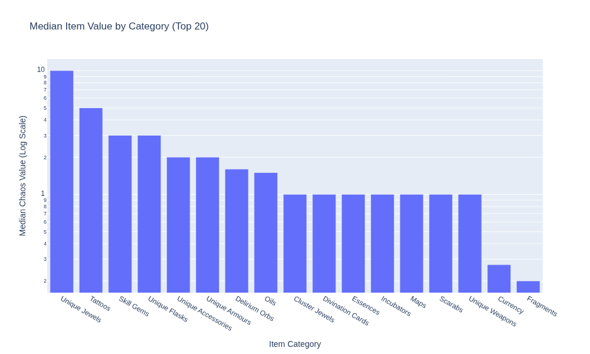
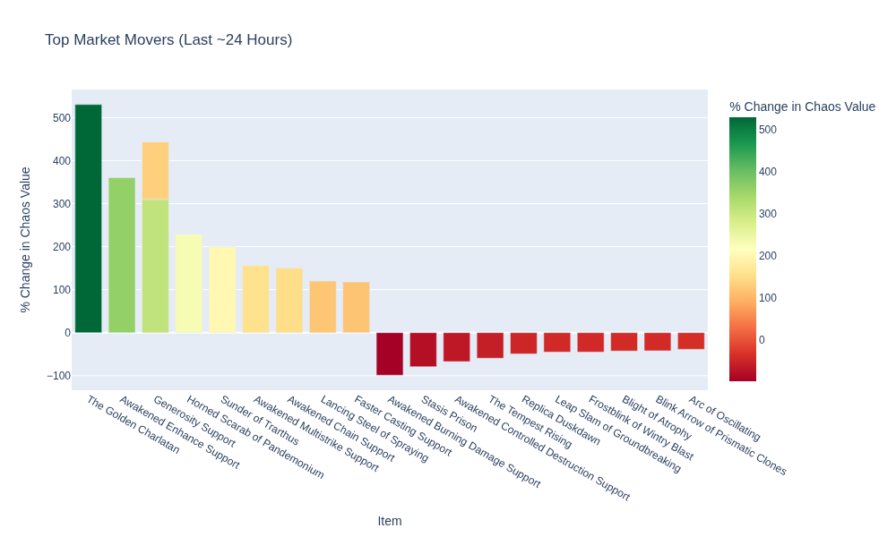

# PoE Tracker

This repository tracks data the Keepers league.

## Maintenance Status

<!-- START_MAINTENANCE -->
| Metric | Value |
|:---|:---|
| Last Successful Run (UTC) | `2025-11-03 19:26:41.461212` |
| Total Price Entries in DB | `968,126` |

<!-- END_MAINTENANCE -->

## Category Analysis

<!-- START_CATEGORY_ANALYSIS -->
### Most Valuable Item by Category
| Category | Top Item | Imputed Chaos Value |
| :--- | :--- | :--- |
| Unique Jewels | Voices | 17,850.0 |
| Unique Accessories | Mageblood | 15,600.0 |
| Skill Gems | Awakened Multistrike Support | 9,880.0 |
| Unique Flasks | Progenesis | 6,760.0 |
| Unique Armours | Svalinn | 5,824.0 |
| Divination Cards | House of Mirrors | 4,680.0 |
| Unique Weapons | Voidforge | 3,931.0 |
| Scarabs | Horned Scarab of Preservation | 208.0 |
| Cluster Jewels | Wand Attacks deal 12% increased Damage with Hits and Ailments | 197.2 |
| Tattoos | Tattoo of the Ramako Shaman | 137.6 |
| Maps | Ziggurat Map | 40.0 |
| Oils | Golden Oil | 33.0 |
| Essences | Essence of Horror | 12.0 |
| Delirium Orbs | Skittering Delirium Orb | 5.0 |
| Incubators | Ornate Incubator | 3.0 |

<!-- END_CATEGORY_ANALYSIS -->

## Market Movers & Overall Value

<!-- START_ANALYSIS -->
### Top 10 Most Valuable Items (Overall)
| Item | Imputed Chaos Value |
| :--- | :--- |
| Voices | 17,850.0 |
| Mageblood | 15,600.0 |
| Original Sin | 14,092.0 |
| Headhunter | 12,002.0 |
| Nimis | 11,544.0 |
| Awakened Multistrike Support | 9,880.0 |
| Awakened Multistrike Support | 9,797.0 |
| Awakened Greater Multiple Projectiles Support | 6,864.0 |
| Progenesis | 6,760.0 |
| Awakened Enlighten Support | 6,656.0 |

<!-- END_ANALYSIS -->

---
