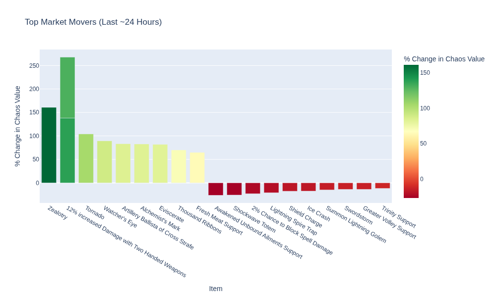

# PoE Tracker

This repository tracks data the **Mercenaries** league.

## Maintenance Status

<!-- START_MAINTENANCE -->
| Metric | Value |
|:---|:---|
| Last Successful Run (UTC) | `2025-10-07 07:42:18.063647` |
| Total Price Entries in DB | `536,048` |

<!-- END_MAINTENANCE -->

## Category Analysis

<!-- START_CATEGORY_ANALYSIS -->
### Most Valuable Item by Category
| Category | Top Item | Imputed Chaos Value |
| :--- | :--- | :--- |
| Skill Gems | Seismic Trap of Swells | 999,999.0 |
| Unique Accessories | Original Sin | 268,443.5 |
| Unique Jewels | Voices | 255,644.5 |
| Unique Armours | The Tempest's Liberation | 57,144.2 |
| Divination Cards | House of Mirrors | 26,086.7 |
| Unique Flasks | Wine of the Prophet | 22,975.8 |
| Unique Weapons | Cadigan's Authority | 7,037.1 |
| Cluster Jewels | 12% increased Trap Damage, 12% increased Mine Damage | 1,313.7 |
| Tattoos | Journey Tattoo of the Body | 1,129.1 |
| Oils | Tainted Oil | 656.5 |
| Scarabs | Horned Scarab of Preservation | 525.2 |
| Incubators | Gemcutter's Incubator | 446.4 |
| Maps | Fortress Map | 80.0 |
| Essences | Essence of Horror | 40.0 |
| Delirium Orbs | Fossilised Delirium Orb | 22.5 |

<!-- END_CATEGORY_ANALYSIS -->

## Market Movers & Overall Value

<!-- START_ANALYSIS -->
### Top 10 Most Valuable Items (Overall)
| Item | Imputed Chaos Value |
| :--- | :--- |
| Seismic Trap of Swells | 999,999.0 |
| Awakened Enlighten Support | 730,458.4 |
| Awakened Empower Support | 524,103.9 |
| Awakened Enhance Support | 365,229.2 |
| Original Sin | 268,443.5 |
| Voices | 255,644.5 |
| Awakened Enlighten Support | 211,832.9 |
| Awakened Enlighten Support | 200,876.1 |
| Awakened Enhance Support | 182,614.6 |
| Awakened Empower Support | 182,614.6 |

<!-- END_ANALYSIS -->

---
